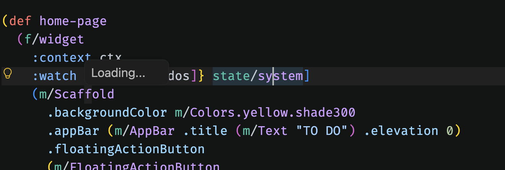
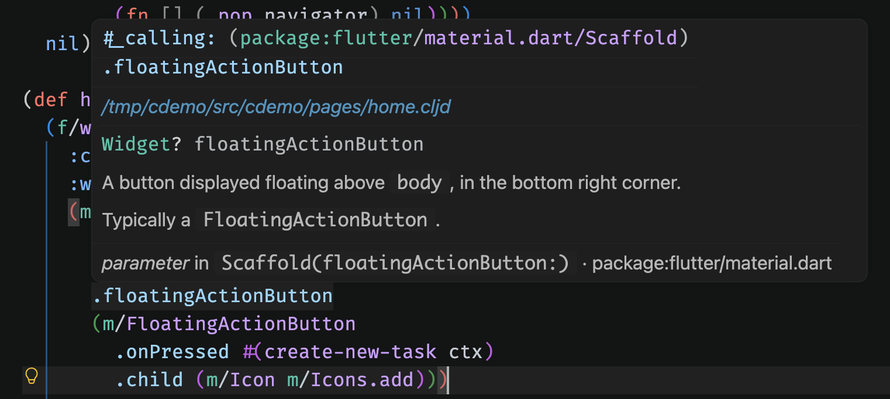
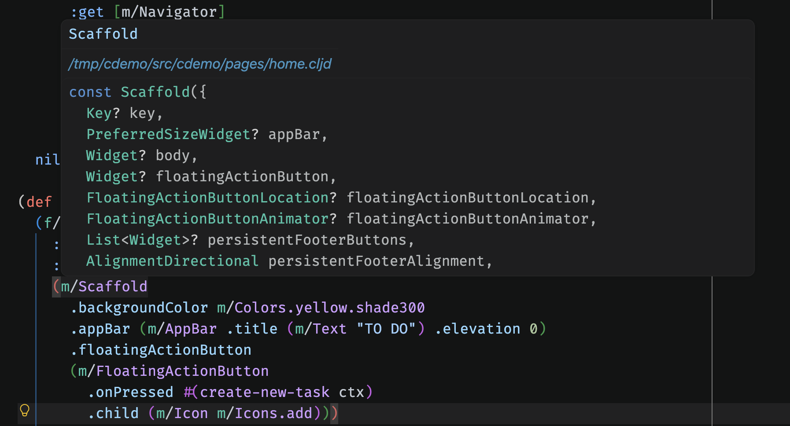

# cljd-resolve

Hover docs and jump-to-definition for ClojureDart in VSCode.

Put the cursor on `m/Text`, `m.Colors/red` or a `.style` argument in a `.cljd` file and get the
real Dart doc comment — and `F12` to the declaration in the Flutter SDK. It works by resolving
the symbol under the cursor to a Dart element itself, so it needs no running REPL and no
compiled build.

It sits beside Calva rather than replacing it: Calva keeps answering for everything
Clojure-shaped, and this answers for the Dart edge.

## See it in VS Code

The resolver warms up in the background when you open a `.cljd` file, then surfaces Dart
documentation and signatures directly in your ClojureDart source.

**Warm-up status** — a small loading indicator confirms that the analyzer is starting.



**Dart documentation on hover** — hover a named argument to see its type, documentation, and
the Flutter declaration it belongs to.



**Constructor signatures on hover** — hover a widget to inspect the resolved Dart constructor
and its available parameters.



**Status:** hover, jump-to-definition and the `cmd+enter` binding all work. There is no
marketplace release — it runs from a checkout, so [installing](#install) means a symlink or a
scratch window.

## Requirements

- **[babashka](https://babashka.org) (`bb`) on your `PATH`** — the daemon runs on it
- **a Dart SDK** — the analyzer helper is a Dart program
- a ClojureDart project to point it at

## Install

**It runs from this checkout; there is no `.vsix`.** The extension is five dependency-free
files, but the daemon and Dart helper it drives do not travel — [why](docs/architecture.md#why-it-runs-from-the-checkout).
So both supported installs point VSCode at `extension/` where it already sits:

```bash
git clone https://github.com/Yaiba/cljd-resolve.git && cd cljd-resolve
dart pub get --directory=helper

# then either -- a scratch window, for trying it out
code --extensionDevelopmentPath="$PWD/extension" /path/to/a/cljd/project

# or a symlink, to have it always on
ln -s "$PWD/extension" ~/.vscode/extensions/cljd-resolve
```

macOS, Linux and Windows are supported; the extension picks `bin/cljd-resolve` (POSIX `sh`) or
`bin/cljd-resolve.cmd` for the host platform.

**If hovers do nothing, it is almost always `bb`.** VSCode launched from Finder inherits a much
barer `PATH` than your terminal does. Run *ClojureDart: Show Resolve Log* — it says so plainly —
and add the directory to `cljd-resolve.extraPath`. Common Homebrew, local-bin, Scoop, Chocolatey
and WinGet locations are already tried as platform-appropriate fallbacks.

Opening a `.cljd` file warms the project up, which takes ~8 s once per project and keeps that
cost off your first hover. After it, a hover is ~13 ms.

## What resolves

| in the buffer | resolves to |
|---|---|
| `(m/Text ...)` | the **unnamed constructor** of `Text` |
| `m/Text` elsewhere | the class `Text` in the aliased library |
| `m/Text.rich` | its named constructor |
| `m.Colors/red` | static member `red` of `Colors` |
| `pi` (`:refer`red) | top-level `pi` in `dart:math` |
| `.style` | the named parameter of the enclosing constructor call — else a field or method of that class |

Aliases come from the `ns` form, and only string requires get one: `[cljd.flutter :as f]` has
nothing behind it the analyzer can answer for, so `f/run` deliberately resolves to nothing.

**What it gives up on:** `(.substring s 1)` — a method call on a value — needs real type
inference, so it resolves to nothing rather than to a guess. An unresolvable cursor is always
silent, never an error.

## Settings and commands

| setting | |
|---|---|
| `cljd-resolve.daemonPath` | path to `bin/cljd-resolve` (or `.cmd`); empty means the repo above the extension, then `PATH` |
| `cljd-resolve.extraPath` | directories prepended to `PATH` when spawning the daemon |
| `cljd-resolve.requestTimeout` | ms to wait for one resolve (default 20000) |
| `cljd-resolve.warmUp` | start the analyzer when a `.cljd` file opens (default true) |
| `cljd-resolve.trace` | log every request and result |

*ClojureDart: Restart Resolve Daemon* · *Clear Analyzer Cache* — after the project's own Dart
changes · *Show Resolve Log*.

A status bar item appears for `.cljd` files: spinning while the analyzer starts, and a click
away from the log.

`cmd+enter` (macOS) or `ctrl+alt+enter` jumps to the definition; the extension contributes the
binding, so there is nothing to put in `keybindings.json`. `F12` and `alt+F12` work unchanged.

## How it works

```
extension/  the VSCode extension -- knows nothing about Dart
src/        the resolve daemon: cursor in a .cljd buffer -> Dart element
helper/     ClojureDart's Dart-analyzer bridge, patched to emit docs and locations
vendor/     the pristine upstream analyzer.dart, for `diff`
bin/        cljd-resolve / .cmd -- launch the daemon
test/       the suites, plus test/fixture, the Dart project they run against
```

- **[docs/architecture.md](docs/architecture.md)** — what each piece does and why it is shaped
  that way: the analyzer patch, symbol resolution and its edge cases, warm-up, failure handling
- **[docs/protocol.md](docs/protocol.md)** — the daemon's JSON-RPC surface, drivable from a shell
- **[docs/testing.md](docs/testing.md)** — the suites, the three test targets, and CI
- **[vendor/README.md](vendor/README.md)** — upgrading the vendored `analyzer.dart`
- **[design.md](design.md)** — the original design: why hovers don't work today, and the routes
  considered

## Tests

```bash
bb test        # everything that does not need a Flutter SDK
```

Suites that need a Dart SDK or a Flutter project print `SKIP` and pass when they can't run, so
this works on a clean checkout. See [docs/testing.md](docs/testing.md).
